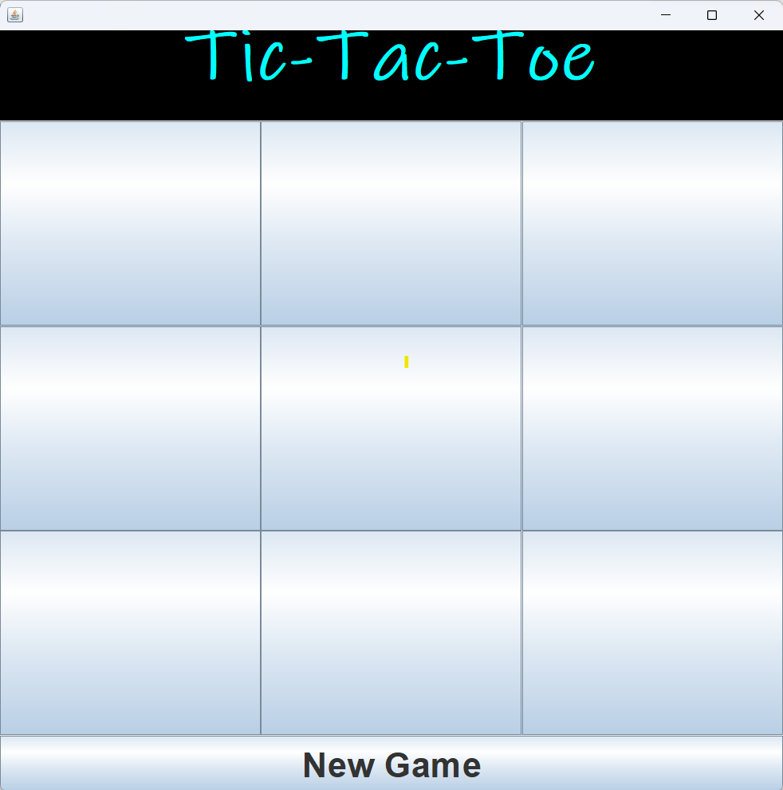
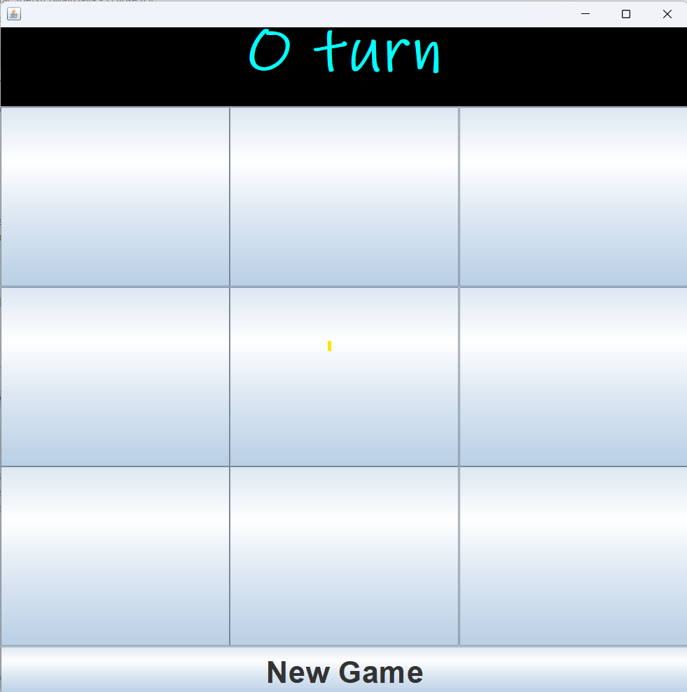
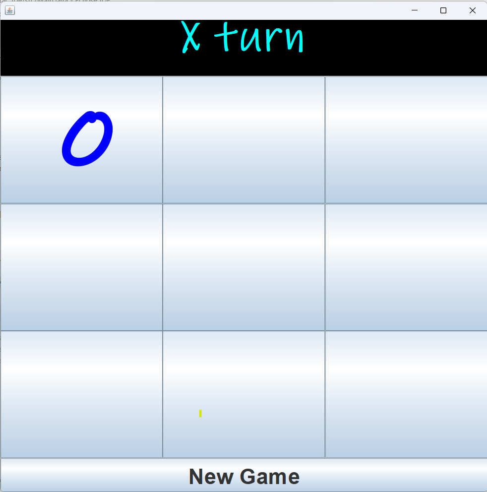
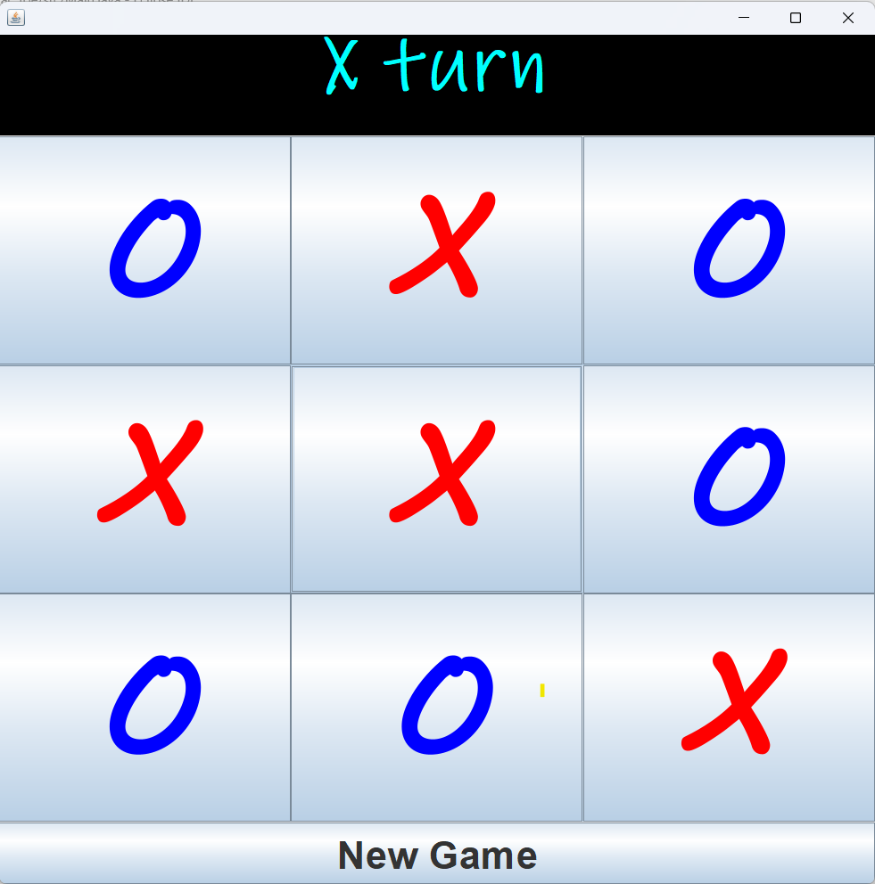
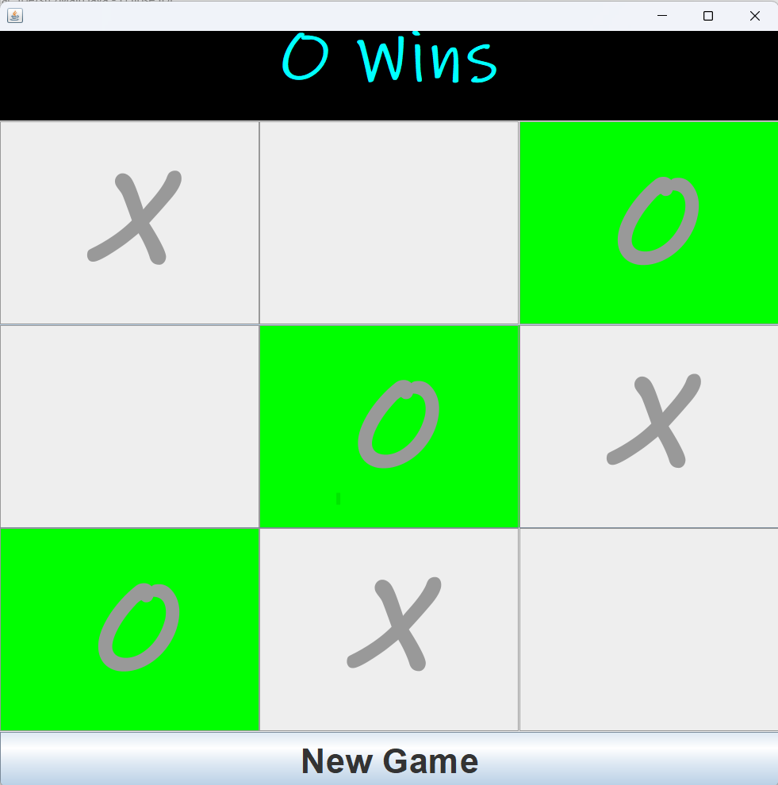
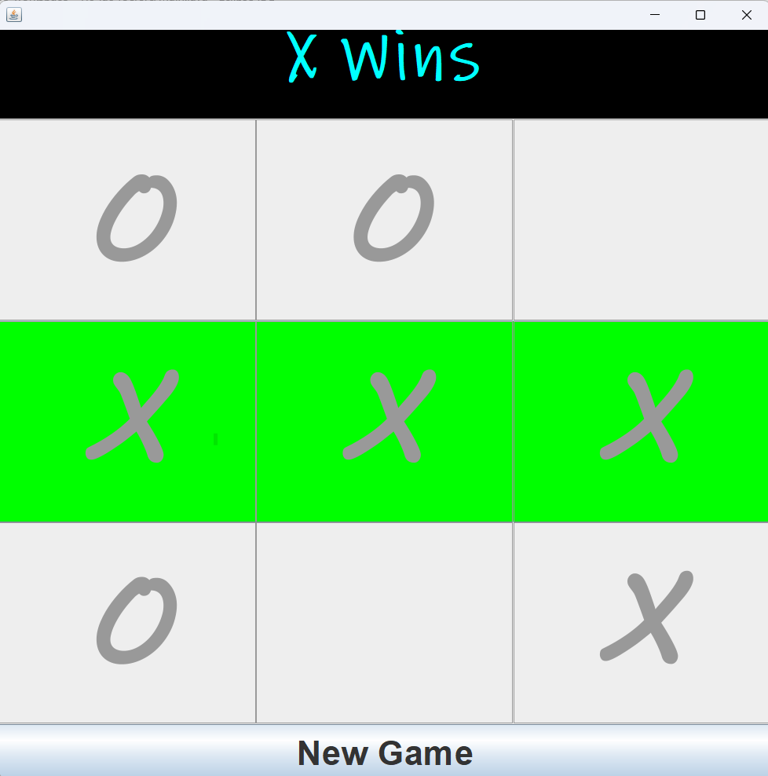

## Tic-Tac-Toe Java Game

A simple implementation of the classic Tic-Tac-Toe game using Java Swing.

### Table of Contents

1. [Introduction](#introduction)
2. [Features](#features)
3. [Installation](#installation)
4. [Usage](#usage)
5. [Contributing](#contributing)
6. [License](#license)

### Introduction

This Java application allows you to play the classic Tic-Tac-Toe game against a friend. It provides a graphical user interface (GUI) for an interactive gaming experience.

### Features

- Graphical user interface with a 3x3 grid.
- Alternating turns between 'X' and 'O.'
- Win detection for both 'X' and 'O.'
- Option to start a new game.
- Responsive design for different screen sizes.

### Screenshots

<br>
<br>

<br>
<br>

<br>
<br>

<br>
<br>

<br>
<br>

<br>
<br>

### Installation

To run this Tic-Tac-Toe game, follow these steps:

1. **Prerequisites**: Ensure you have Java Development Kit (JDK) installed on your system.

2. **Clone the Repository**: Clone this repository or download the source code.

   ```sh
   git clone https://github.com/arshadpatel/tic-tac-toe
3. **Navigate to the Directory**: Go to the project directory.

   ```sh
   cd TicTacToe
4. **Compile the Code**: Compile the Java code.

   ```sh
   javac Main.java

5. **Run the Application**: Start the game.

   ```sh
   java Main

### Usage

- When you run the application, the Tic-Tac-Toe game window will appear.
- The game starts with 'X' making the first move.
- Click on the empty cells in the grid to place your 'X' or 'O.'
- The game will automatically detect a win or a draw and display the result.
- To start a new game, click the "New Game" button.

### Contributing
If you'd like to contribute to this project, please follow these guidelines:

1. **Fork the Repository**: Fork this repository to your own GitHub account.
2. **Create a New Branch**: Create a new branch for your feature or bug fix.

   ```sh
   git checkout -b feature/your-feature
3. **Commit Changes**: Commit your changes and push them to your fork.

   ```sh
   git commit -m "Add your feature"
   git push origin feature/your-feature
4. **Create a Pull Request**: Create a pull request to the main repository.
5. **Review and Merge**: Wait for the maintainers to review and merge your changes.

### License

This project is created for practice purposes and does not include a specific license. You are free to use, modify, and distribute the code as per your own discretion. However, it's always a good practice to give credit to the original author if you decide to use or share this code.
